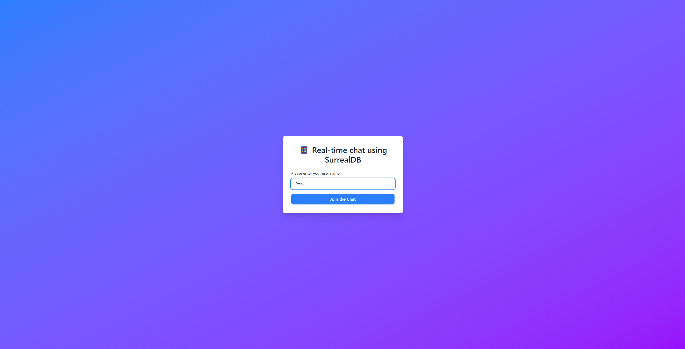

# 📱 Real-time Chat using SurrealDB

A modern real-time chat application built with **Next.js**, **React**, **TypeScript**, and **SurrealDB** WebSocket features. This project demonstrates how to implement real-time communication using SurrealDB's live queries and WebSocket capabilities.



## ✨ Features

- 🚀 **Real-time messaging** using SurrealDB's live queries
- 💬 **Instant message synchronization** across multiple clients
- 🔐 **Simple authentication** with username-based sessions
- 📱 **Responsive design** optimized for both desktop and mobile
- 🎨 **Modern UI** with Tailwind CSS v4
- ⚡ **Fast development** with Next.js 15 and Turbopack
- 🔄 **Automatic reconnection** with connection status indicators
- 📊 **Message history** with timestamp display
- 🎯 **Type-safe** implementation with TypeScript

## 🛠 Tech Stack

- **Frontend**: Next.js 15, React 19, TypeScript
- **Styling**: Tailwind CSS v4
- **Database**: SurrealDB
- **Real-time**: SurrealDB WebSocket & Live Queries
- **Development**: Turbopack, ESLint

## 📋 Prerequisites

Before running this application, make sure you have:

- **Node.js** (v18 or later)
- **npm** or **yarn**
- **Docker** (for running SurrealDB)

## 🚀 Quick Start

### 1. Start SurrealDB Server

First, start the SurrealDB server using Docker:

```bash
docker run --rm -p 8000:8000 surrealdb/surrealdb:latest start --user root --pass root
```

The server will be available at `http://localhost:8000`

### 2. Clone and Setup

```bash
# Clone the repository
git clone https://github.com/chantakan/surrealdb-chat-app.git
cd surrealdb-chat-app

# Install dependencies
npm install

# Start the development server
npm run dev
```

### 3. Access the Application

Open your browser and navigate to `http://localhost:3000`

## 📖 Usage

### Joining the Chat

1. Enter your username on the welcome screen
2. Click "Join the Chat" to connect to the real-time chat


### Chatting

1. Type your message in the input field
2. Press Enter or click "Send" to send the message
3. Watch messages appear in real-time from other users


## 🏗 Architecture

### Database Schema

The application uses a simple SurrealDB schema:

```sql
DEFINE TABLE messages SCHEMAFULL;
DEFINE FIELD username ON messages TYPE string ASSERT $value != NONE;
DEFINE FIELD message ON messages TYPE string ASSERT $value != NONE;
DEFINE FIELD timestamp ON messages TYPE datetime DEFAULT time::now();
DEFINE INDEX messages_timestamp_idx ON messages COLUMNS timestamp;
```

### Real-time Implementation

- **Live Queries**: Uses SurrealDB's `LIVE` queries to monitor database changes
- **WebSocket Connection**: Maintains persistent connection for real-time updates
- **Automatic Reconnection**: Handles connection drops and reconnects automatically

### Key Components

- `Chat.tsx`: Main chat interface component
- `lib/surrealdb.ts`: SurrealDB service layer with connection management
- `app/page.tsx`: Root page component
- `app/globals.css`: Global styles and animations

## 🔧 Development

### Available Scripts

```bash
# Development server with Turbopack
npm run dev

# Production build with Turbopack
npm run build

# Start production server
npm run start

# Run linting
npm run lint
```

### Connection Management

The application automatically tries multiple connection strategies:

1. WebSocket connection (`ws://localhost:8000/rpc`)
2. HTTP connection (`http://localhost:8000/rpc`)
3. Alternative endpoints with different URLs
4. Fallback connections for different environments

### Error Handling

- **Connection errors**: Displays user-friendly error messages
- **Message failures**: Logs errors and provides feedback
- **Network issues**: Automatic retry mechanisms

## 🐛 Troubleshooting

### Common Issues

**1. Connection Failed**
```
Unable to connect to SurrealDB server
```
- Ensure Docker container is running: `docker ps`
- Check if port 8000 is available: `netstat -an | grep 8000`
- Try restarting the SurrealDB container

**2. WebSocket Connection Issues**
```
WebSocket connection failed
```
- Browser may be blocking WebSocket connections
- Try using HTTP connection fallback
- Check browser console for CORS errors

**3. Authentication Errors**
```
Authentication failed
```
- Verify SurrealDB is started with `--user root --pass root`
- Check database credentials in the connection code

### Debug Mode

Enable debug logging by opening browser console. The application provides detailed connection logs.

## 📁 Project Structure

```
surrealdb-chat-app/
├── app/
│   ├── globals.css          # Global styles and animations
│   └── page.tsx            # Root page component
├── components/
│   └── Chat.tsx            # Main chat component
├── lib/
│   └── surrealdb.ts        # SurrealDB service layer
├── assets/
│   ├── demo_username.png   # Username input demo
│   └── demo_chat.mp4      # Chat functionality demo
├── package.json            # Dependencies and scripts
└── README.md              # This file
```

## 🤝 Contributing

1. Fork the repository
2. Create your feature branch (`git checkout -b feature/amazing-feature`)
3. Commit your changes (`git commit -m 'Add amazing feature'`)
4. Push to the branch (`git push origin feature/amazing-feature`)
5. Open a Pull Request

## 📄 License

This project is open source and available under the [MIT License](LICENSE).

## 🙏 Acknowledgments

- **SurrealDB Team** for the amazing database and real-time features
- **Next.js Team** for the excellent React framework
- **Tailwind CSS** for the utility-first CSS framework

---

**Made with ❤️ using SurrealDB, Next.js, and TypeScript**

For more information about SurrealDB, visit: https://surrealdb.com/
